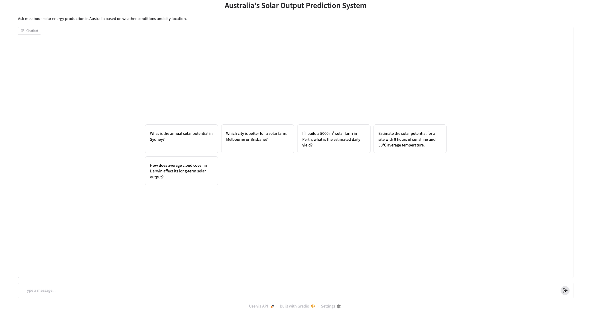

# LIM-case-1 Predicting Solar Output

## Overview

This project is a case study for Stratpoint. It focuses on developing a system designed to predict the solar output. The AI was trained using the Australia Daily Weather Dataset and Global Solar Atlas PVOUT GeoTIFFS.

### Key Features Include:

- **Geospatial Extraction:** Automatically extracts Long-Term Average (LTAy) solar values from TIFF rasters for specific coordinates.
- **Predictive Intelligence:** Uses an XGBoost regressor to correlate 16 climate features (Sunshine, Temperature, Cloud Cover, etc.) with annual solar output.
- **Explainable AI:** Integrated SHAP analysis to visualize how different weather parameters impact solar potential.
- **Semantic Orchestration:** A tool-calling LLM agent (Llama 3.3 70B via Groq) that translates complex user queries into deterministic model calls.
- **Interactive UI:** A user-friendly chat interface for exploring city-level data, custom site estimates, and solar farm yield calculations.

## Architecture

1.  **Data Layer:**
    - Australia Daily Weather Dataset (Climate features).
    - Global Solar Atlas PVOUT GeoTIFFs (Target values).
2.  **Processing Layer:**
    - `src/processing/extract_raster.py`: GIS processing using `rasterio`.
    - `src/processing/create_aggregate_dataset.py`: Feature engineering and data merging.
3.  **Model Layer:**
    - `src/modeling/train_potential_model.py`: XGBoost training pipeline.
    - `src/modeling/predictor.py`: Real-time prediction interface.
4.  **Agent Layer:**
    - `src/agent/agent.py`: LangChain orchestration with tool calling.
5.  **Interface Layer:**
    - `app.py`: Gradio-based chat interface.

## Installation & Setup

### Prerequisites

- Python 3.9+
- (Conda) Virtual environment (optional but recommended)

### Setup

After cloning the repo and activating the python environment, please install the dependencies using the following command:

```bash
pip install -r requirements.txt
```

Create a `.env` file in the root directory and add the GROQ_API_KEY:

```env
GROQ_API_KEY=your_groq_api_key_here
```

Can be obtained from https://console.groq.com/api-keys

## Usage

Launch the interface by running:

```bash
python src/app.py
```

This will provide a local URL (e.g., `http://127.0.0.1:7860`).

Once you open the link you should see something like this:


TADA!

## Replicating the Pipeline

If you want to retrain the model or reproduce the dataset from scratch, you follow these steps:

### 1. Data

- **Solar GIS Data:**
  1. Visit the [Global Solar Atlas Download Page](https://globalsolaratlas.info/download/australia).
  2. Download the **GIS Data** for **PVOUT** (Photovoltaic power potential).
  3. Ensure you select the **LTAy (Long-term average of yearly totals)** product in GeoTIFF format.
  4. Place the extracted folders in the `data/` directory.

- **Weather Data:**
  1. The training is based on historical observations from the **Australian Bureau of Meteorology (BoM)**.
  2. You can find the base dataset on [Kaggle (Australia Weather Data)](https://www.kaggle.com/datasets/arunavakrchakraborty/australia-weather-data).
  3. Download and place `Weather Training Data.csv` and `Weather Test Data.csv` into the `data/` directory.

### 2. Running the Pipeline

Execute the scripts in the following order:

1. **Extract Solar Targets:**
   ```bash
   PYTHONPATH=src python src/processing/extract_raster.py
   ```
2. **Create Aggregate Dataset:**
   ```bash
   PYTHONPATH=src python src/processing/create_aggregate_dataset.py
   ```
3. **Train the Model:**
   ```bash
   PYTHONPATH=src python src/modeling/train_potential_model.py
   ```

That's it pancit!
